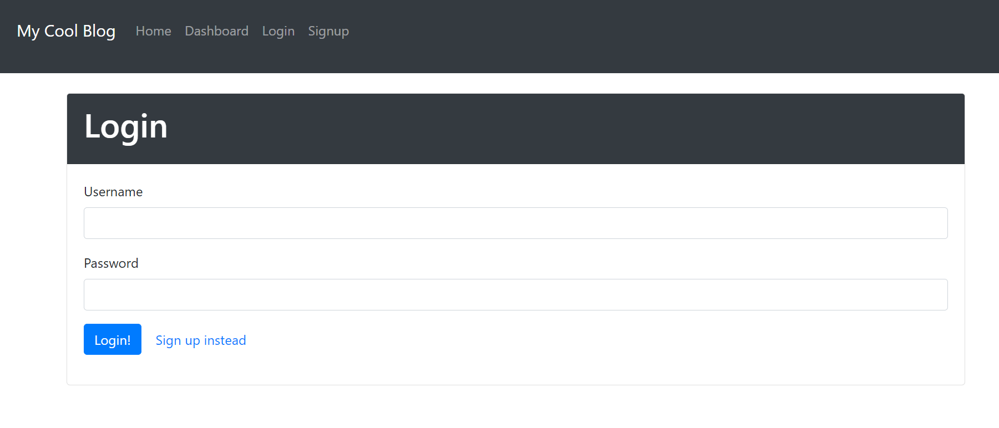

# My Cool Blog

## Description

My Cool Blog is a full-stack web application designed for users to share their thoughts and engage with others by commenting on posts. The application offers a streamlined and user-friendly interface for creating, editing, deleting posts, and adding comments. Built using Node.js, Express, Sequelize, and Handlebars, this project follows the MVC architectural pattern and includes user authentication to ensure secure access to personal dashboards.

## Site Deployment

[Link to Render site]()

## Screenshots

## Technologies Used

- Node.js
- PostgreSQL
- Connect-session-sequelize
- Sequelize
- Express-session
- Bootstrap
- Express.js
- Handlebars.js

## Questions

- Contact: ajgarza27@gmail.com
